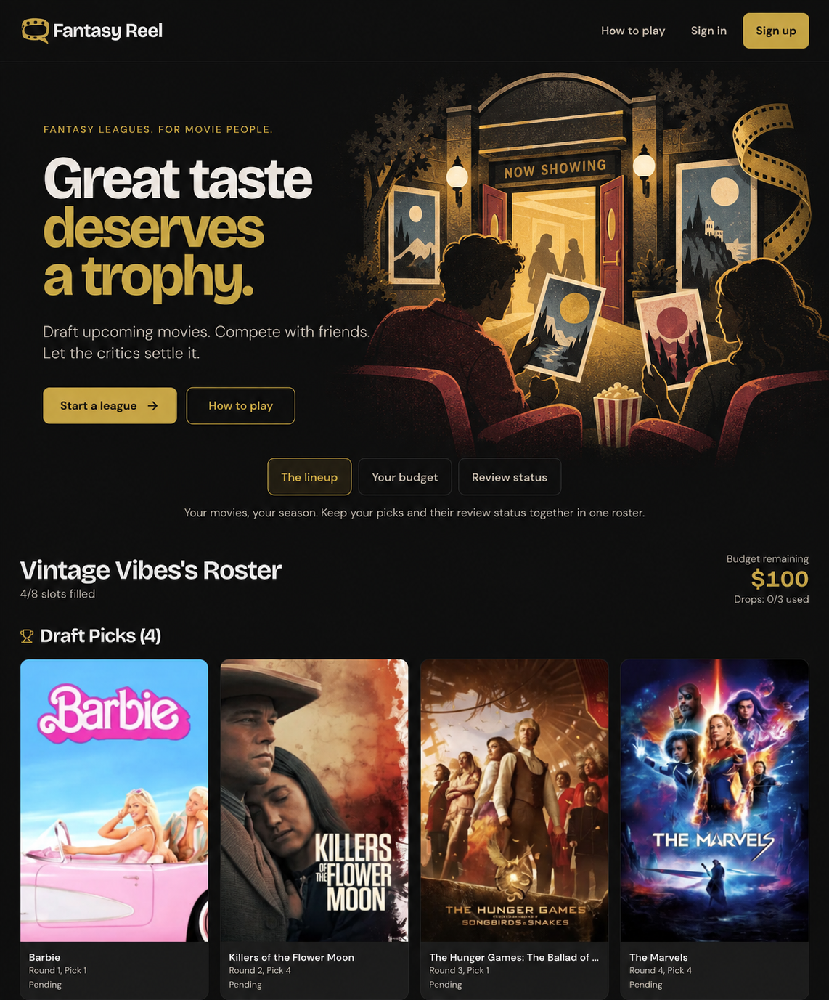
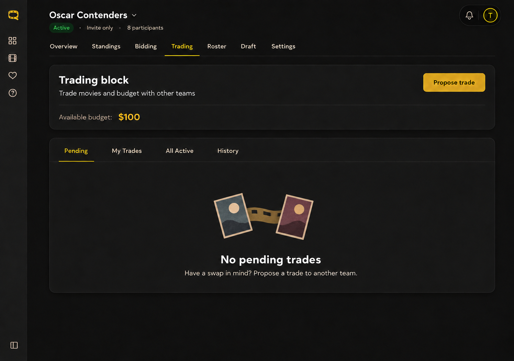
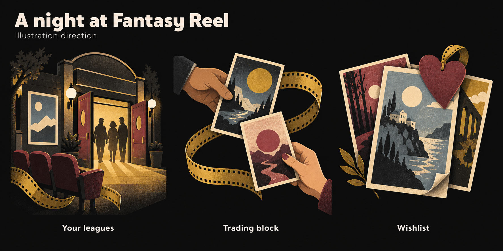

# Illustration and graphic guidance

Fantasy Reel's selected illustration direction is **Storybook**: warm, tactile cinema imagery with paper shapes, restrained grain, and a sense of movie fandom shared with friends. Use one family with detail adapted to the context.

This guide records the direction and concept examples. It does not introduce illustrations into any screens or authorize a rollout. Apply it when illustration work is part of the requested task.

## Two levels of detail

| | Full storybook | Minimal storybook |
| --- | --- | --- |
| Purpose | Create atmosphere and welcome people into the product | Add warmth to an in-app empty or welcome state |
| Subjects | Cinema entrances, friends, seats, movie cards, a curling film ribbon | A few related objects, such as two movie cards and a short film connector |
| Detail | Layered scenery, warm light, expressive silhouettes, visible paper texture | Broad filled shapes, simple poster faces, very light grain, few small marks |
| Color | Richer use of the shared palette and atmospheric contrast | Muted colors that blend with the surrounding surface |
| Reference placement | Homepage hero | Trading empty state, centered above its message |

**Detail and size are separate decisions.** Minimal storybook reduces visual complexity; its footprint depends on the placement. For trading, the chosen direction is a familiar empty-state graphic with plain space on either side. The earlier wide trading composition is superseded.

A future trading implementation could start around **200–240 CSS px wide for the entire illustration**, then check the actual layout on desktop and mobile. This is a starting point, not a measured specification from the generated screenshot. Do not stretch it across the panel or shrink a detailed scene until it becomes unreadable.

## Shared visual language

- **Material and shape:** filled, slightly irregular paper silhouettes, gentle layering, and fine grain confined to the artwork. Minimal variants keep this tactile character while removing scenery, folds, and tiny perforations.
- **Palette:** matte gold, dusty burgundy, warm ivory or taupe, muted blue-gray, and charcoal. Illustration references use gold `#c9a227`, burgundy `#a8505c`, ivory `#ead8b3`, and blue-gray `#718691`. Ivory and blue-gray are art accents, not new UI tokens. Use the existing [theme tokens](themes.md) for surrounding interface elements.
- **Motifs:** independent cinemas, original abstract movie-poster cards, film ribbons, bookmarks, and friends choosing or exchanging movies. Keep each composition focused on its state.
- **Finish:** warm, grown-up editorial illustration. Avoid glossy 3D, metallic gold, neon, stock corporate characters, confetti, dense decorative marks, and realistic movie-character likenesses. Minimal storybook still uses filled paper forms; outline-only sketches and brighter flat-paper explorations are not the selected direction.
- **Identity:** retain the [approved logo and icons](README.md) and [typography roles](typography.md). The logo does not need to change to fit this family. Illustration complements the existing functional icon system.

## Reference examples

These are generated concept images with sample content, not production assets or pixel-accurate UI specifications. Differences in logos, typography, buttons, layout, and movie posters are generation artifacts; use the current app and approved brand assets for those elements. The examples show dark mode only.

### Full homepage

Use the cinema scene to add atmosphere while keeping the headline and primary action clear. Preserve the real interactive product previews, movie posters, and data below the hero. This illustrates a possible composition; it does not require the homepage layout to change.

### Minimal trading empty state

This is the current in-app reference. Each card has a simple moon and broad hill shape. The short connector, muted palette, and light grain retain storybook character at a normal empty-state size. Keep the message and action hierarchy clear, and remove the empty-state art when the selected view contains trades.

### Family and motif reference

Use this original board for materials, palette, and subjects. Its detailed trading and wishlist vignettes are motif references; the minimal trading example above governs the in-app level of detail.

## Placement opportunities

These are candidates for future work, not a requirement to decorate every screen.

| Context | Suggested treatment | Keep clear |
| --- | --- | --- |
| Homepage | One full cinema scene in the hero | Headline, signup action, real product previews |
| Dashboard with no leagues | Minimal cinema entrance or invitation vignette | Create/join actions; let league content lead once populated |
| Empty trading tab | Minimal two-card exchange | Tab-specific message, propose action, budget; an empty Pending tab does not mean there is no trade history |
| Empty wishlist | Minimal movie-card stack with a bookmark | Explore-movies action and saved posters once present |
| Draft waiting/setup | Minimal seats, ticket, or clapperboard | Participant and start information; remove it from live draft controls |
| Empty bids or joining a league | Minimal bid slip or invitation motif | Budget, deadlines, and form fields; avoid a live-auction gavel metaphor for scheduled bid resolution |

Populated rosters, standings, budgets, deadlines, trade confirmations, and dense controls already carry the product's information. Add artwork only where it has a clear purpose. Reuse this family in onboarding or how-to content instead of introducing another style.

## Producing assets in a future task

1. Inspect the current component and state. Choose a subject, detail level, footprint, and relationship to the copy before generating art. Preserve state-specific messages and existing interactions.
2. Use the relevant example as a visual reference. Generate standalone artwork with a transparent surround where appropriate; do not crop a whole mockup into the app. Keep headings, labels, buttons, and real movie posters in their existing components.
3. Check the result on both [Light and Dark themes](themes.md), at desktop and mobile sizes. Avoid a baked dark rectangle, lost silhouettes, or texture behind text. Keep contrast strongest on meaningful text and controls.
4. Export an appropriately sized, optimized web asset, reserve its dimensions to avoid layout shift, and choose alt text by purpose. Use `alt=""` when the nearby empty-state message already communicates its meaning. Follow the repo's normal UI verification workflow if implementing it.

## Reusable art brief

Start with: “Fantasy Reel storybook illustration: tactile matte paper shapes, slightly irregular filled silhouettes, restrained grain, gold, dusty burgundy, warm ivory, muted blue-gray, and charcoal. Inviting independent-cinema mood. Original abstract poster art. Keep interface text, logos, and controls out of the asset.”

For **full storybook**, add a focused environment, a few human silhouettes, layered scenery, and warm cinema light. For **minimal storybook**, use a few simple objects, broad poster shapes, very light texture, subdued contrast, and ample clear surround. Specify the footprint separately from detail.

The [example provenance and original prompts](illustrations/provenance.md) preserve the exploration history. Use this guide for current decisions; historical prompt coordinates and wording are not implementation requirements.
